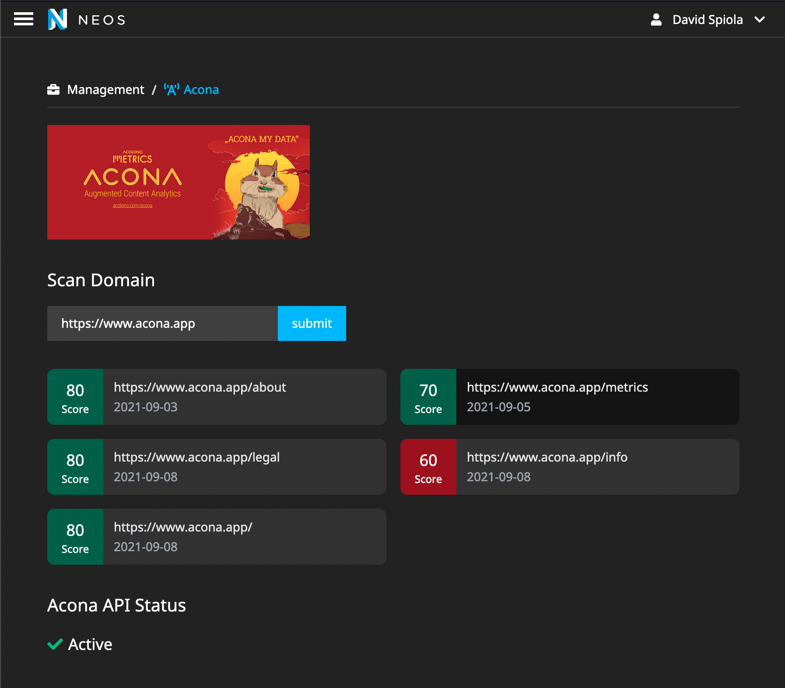

# ACONA Neos CMS Integration

ACONA stands for Augmented Content Analytics - an open source tool that automatically analyzes and simplifies data, for example from server logs or existing (open source) analytics tools, and proposes concrete measures for optimizing content.

The CMS integrations (Drupal, WordPress, Neos) create a bridge between the CMS and the ACONA suite. The idea is that scores and recommendations are shown directly there where editors create and maintain content (in the CMS).

More in the general documentation: https://app.gitbook.com/@acolono/s/acona/

## Features
- ACONA Success Scores: With ACONA you can set up page type specific Success Scores (e.g. you can say that for Landingpages a combination of Organic Clicks and a low Bounce Rate defines the score, and for product pages it is just a specific Conversion Rate). 

## Status and roadmap

Currently the Neos Plugin is a proof of concept and has very limited features. But it will be extended with the following features:
- Analyze more than just 5 URLs (e.g. all URLs from your domain, may require a paid plan for the hosted version)
- History of ACONA Success Scores for every analyzed url
- Show recommendations for every analyzed url, e.g. how content could be improved to get better Success Scores.
- Show notifications and warnings for analyzed URLs, e.g. if a specific metric is much lower/higher than a forecasted value.

## Usage

### 1. Run `composer require ao/acona-neos`


### 2. Set `Setting.Acona.yaml`

Specify a project specific token within your project configuration

```yaml
Ao:
  Acona:
    apiToken: 'yourAccessToken'
```

### 3. Usage

Use the provided backend module to analyze data



## Issues and PRs

Feel free to create issues for PRs if you like.